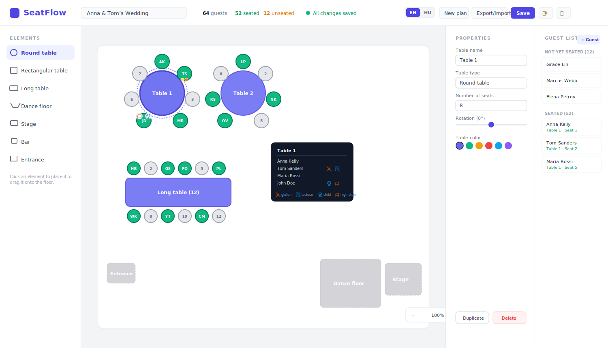

<div align="center">

# SeatFlow

**A beautifully simple, visual seating-plan designer for weddings, parties, and events - 100% local, zero backend.**

[](https://nextjs.org/)
[](https://react.dev/)
[](https://www.typescriptlang.org/)
[](https://tailwindcss.com/)
[]()
[]()

</div>

<br/>

<p align="center">
  
</p>

<p align="center"><em>Illustrative preview of the real interface - drag tables onto the floor, assign guests to seats, and watch everything save itself.</em></p>

<br/>

## Why SeatFlow?

Planning who sits where at a wedding shouldn't require a spreadsheet, a SaaS subscription, or an account. **SeatFlow is a single-page app that runs entirely in your browser** - no sign-up, no server, no tracking, no monthly fee. Open it, start dragging tables onto the floor, and your plan is saved automatically as you go.

It's built for one person planning one event at a time, and it's unapologetically simple because of it.

## Features

| | |
|---|---|
| **Three table shapes** | Round, rectangular, and long tables, each with sensible default seat counts (8 / 6 / 12) |
| **Drag-and-drop floor design** | Click or drag tables, dance floors, stages, bars, entrances, and text labels straight onto the canvas |
| **Pan & zoom canvas** | Scroll to zoom, click-and-drag the floor to pan - works at any scale |
| **Guest management** | Add, rename, delete guests; see who's seated and who isn't at a glance |
| **Drag guests to seats** | Or just click a seat and type a name - whichever is faster |
| **Dietary & accessibility tags** | Mark guests as gluten-sensitive, lactose-sensitive, or having another allergy - shown as recognizable icons (wheat, milk, warning) right on the seat and in hover tooltips |
| **Child seating** | Flag guests as under-3 or 3-12, and mark high-chair requests - all visible on the seating chart |
| **In-app comments** | Leave yourself notes about changes to make; unseen comments show a badge in the header until you check them off |
| **Bilingual UI** | Full Hungarian / English interface toggle, remembered across sessions |
| **Print-ready view** | A clean, chrome-free printout of the floor plan and guest table - perfect for the day-of binder |
| **Export / Import** | Back up or transfer your entire plan as a single JSON file |
| **Auto-save** | Every change is saved to your browser's local storage within half a second - reload any time, nothing is lost |
| **Undo** | Made a mistake? `Ctrl/Cmd+Z` steps back through your edit history |
| **Responsive** | Full editing on desktop, touch-friendly drawers on tablet and mobile |

## Design philosophy

- **No account. No database. No backend.** Everything lives in `localStorage`, in your browser, on your machine.
- **No subscriptions, no payments, no team features.** It's a tool for one person.
- **Works offline** once loaded - there's nothing to phone home to.
- **Simple by design.** No over-engineered state machines or plugin systems - just React, Tailwind, and a handful of well-named components.

## Getting started

```bash
npm install
npm run dev
```

Then open **[http://localhost:3000](http://localhost:3000)** - you're straight into the floor planner with a pre-populated demo layout. No onboarding, no landing page.

### Other scripts

```bash
npm run build     # production build
npm start         # run the production build
npm run lint      # ESLint
```

## Tech stack

- **[Next.js 16](https://nextjs.org/)** (App Router, Turbopack) - client-rendered, no server-side data fetching
- **[React 19](https://react.dev/)** with Context + `useReducer` for state (no external state library - this app doesn't need one)
- **[TypeScript](https://www.typescriptlang.org/)** throughout
- **[Tailwind CSS 4](https://tailwindcss.com/)** for styling
- **[Lucide React](https://lucide.dev/)** for icons

## Project structure

```
src/
├── app/                   Next.js App Router entry (layout, page, global styles)
├── components/            All UI components - one concern per file
│   ├── AppHeader.tsx          Top bar: event name, stats, save status, actions
│   ├── EditorSidebar.tsx      Left toolbar of placeable elements
│   ├── FloorCanvas.tsx        The pannable/zoomable floor surface
│   ├── TableElement.tsx       A table shape + its seats + hover tooltip
│   ├── SeatElement.tsx        A single seat, its badges, and tooltip content
│   ├── PropertiesPanel.tsx    Right-hand editor for the selected item
│   ├── GuestList.tsx          Guest roster with seated/unseated grouping
│   ├── SeatDialog.tsx         Modal for assigning a guest to a seat
│   ├── GuestDialog.tsx        Modal for adding/editing a guest
│   ├── CommentsDialog.tsx     In-app feedback/notes panel
│   ├── PrintView.tsx          Print-only layout
│   └── ExportImportDialog.tsx JSON export/import
├── context/                State providers (Plan, Language, Comments)
├── lib/                     Pure logic: seat layout math, reducer, translations, storage
└── types/                   Shared TypeScript types
```

## Data & privacy

All data - your event, tables, guests, and seating assignments - is stored exclusively in your browser's `localStorage`. Nothing is ever sent to a server. Clearing your browser data will erase your plan, so use the **Export** button to keep a JSON backup of anything you don't want to lose.

## License

MIT - do whatever you'd like with it.
